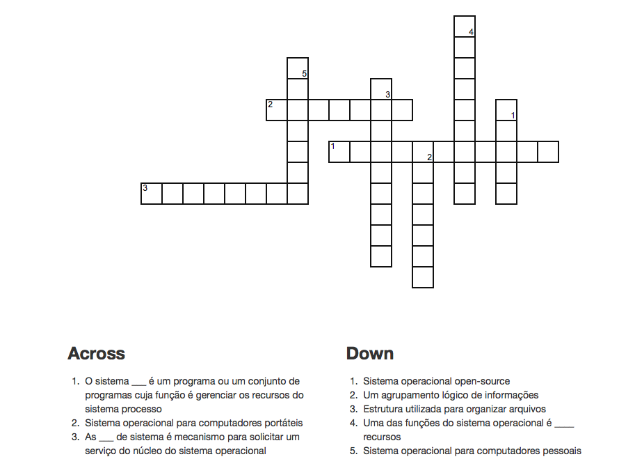

# Questões de Revisão

1. O que é um sistema operacional?

2. Qual a funçao de um sistema operacional?

3. Quais são os recursos que um sistema operacional gerencia?

4. Quais são as gerações de hardware que a evolução dos sistemas operacionais acompanhou?

5. Quais são os tipos de sistemas operacionais?

6. Quais são os principais sistemas operacionais para computadores pessoais?

7. Quais são os principais sistemas operacionais para computadores portáteis?

8. Quais é um processo?

9. O que é o PID?

10. O que são os arquivos?

11. O que é um diretório?

12. O que é um caminho de arquivo?

13. O que é um interpretador de comando?

14. Cite um exemplo de uso do interpretador de comando.

15. O que são chamadas de sistemas?

16. Cite um exemplo de uso de chamadas de sistemas.

18. Resolva o caça-palavras abaixo:

